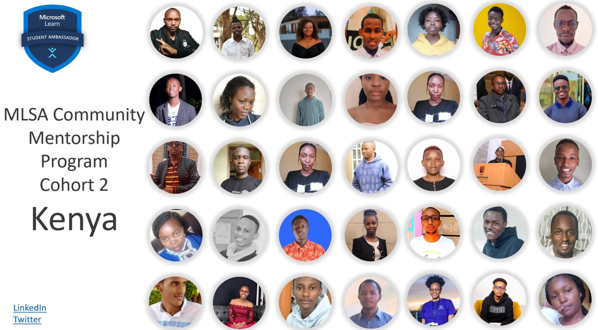

# Microsoft Learn Student Ambassadors Community Mentorship Resource Bank

## Introduction

The [MLSA Community Mentorship Program](https://aka.ms/PeerMentorshipProgramBlog1) is a 3-month program that provides a space for Student Ambassadors to WELCOME the larger student developer community into the tech space through guided learning, GUIDE them through group mentorship engagements and CONNECT them to various Microsoft opportunities, experiences, and products

## Resources
| Resource | Link |
| --------------| ---------------------| 
| Azure for Students (No Credit Card information required) | [Claim your $100 free Azure credits and 25+ free Azure services](https://azure.microsoft.com/en-us/free/students/?WT.mc_id=academic-0000-juliamuiruri) 
| Microsoft Student Hub | [Access the Microsoft Student Hub](https://learn.microsoft.com/en-gb/training/student-hub/?WT.mc_id=academic-0000-juliamuiruri) |
| Microsoft imagine Cup | [Participate in Microsoft's global student hackathon](https://imaginecup.microsoft.com/en-us/Events/?WT.mc_id=academic-0000-juliamuiruri) |
| Microsoft Learn for Students | [Access student learning paths & modules for your personal skilling ](https://learn.microsoft.com/en-us/training/browse/?WT.mc_id=academic-0000-juliamuiruri%2F%3Froles%3Dstudent) |
| Student Certifications | [Claim free industry-recognized certifications ](https://learn.microsoft.com/en-us/training/student-hub/certifications?WT.mc_id=academic-0000-juliamuiruri) |
 

### Azure Resources
| Azure Resource | Additional Resources | Call To Action |
| --------------| ---------------------| -------------- |
| Azure Static Web Apps | [Launch a site to the Cloud using github.dev & Azure Session ](https://youtu.be/ZjHZ5zCGPbk?t=8530)| Deploy a resume website on an Azure Static Web App for free

 

## Category 1: General Sessions
| Session Title | Additional Resources | Call To Action |
| --------------| ---------------------| -------------- |
| CV/Resume Best Practices | [Session Recording](https://techcommunity.microsoft.com/t5/educator-developer-blog/microsoft-university-student-recruiting-in-africa/ba-p/3565660?WT.mc_id=academic-0000-juliamuiruri)   [Presentation Deck](https://stdntpartners-my.sharepoint.com/personal/julia_muiruri_studentambassadors_com/_layouts/15/onedrive.aspx?id=%2Fpersonal%2Fjulia%5Fmuiruri%5Fstudentambassadors%5Fcom%2FDocuments%2FFY%2723%20Africa%20UR%20%2D%20CV%20Workshop%2Epdf&parent=%2Fpersonal%2Fjulia%5Fmuiruri%5Fstudentambassadors%5Fcom%2FDocuments&ga=1) | Create your 1-pager CV and be ready to apply for your next role |
| Panel Discussion with Microsoft Interns & software engineers | [Session Recording](https://youtu.be/EivDGoY5__4) | Polish up on your CS Fundamentals - [Data Structures & Algorithms](https://www.microsoft.com/MEA/Gameoflearners/Clinics/TheFundametals.aspx/?WT.mc_id=academic-0000-juliamuiruri)   Create a profile on [Microsoft's career website](https://careers.microsoft.com/us/en) |
| Business Canvas Model & Project Ideation | [Session Recording](https://youtu.be/6H3Fn2NFg_k) | Write a business model for your project |
| Startup Ecosystem in Kenya & Presentation skills | [Session Recording](https://youtu.be/XWJ-ahwJaXg?t=97) | TBD
 

## Category 2: Web Development Sessions
| Session Title | Additional Resources | Call To Action |
| --------------| ---------------------| -------------- |
| Introduction to Programming and Tools of the Trade | [Session Recording](https://youtu.be/DdchDmK63TU)   [Full Workshop on GitHub](https://github.com/microsoft/Web-Dev-For-Beginners/blob/main/1-getting-started-lessons/1-intro-to-programming-languages/README.md)| TBD
| Git & GitHub Workshop | [Session Recording](https://aka.ms/PeerMentorshipGitHubWorkshop)   | Create a GitHub Account
| Introduction to Microsoft Azure | [Session Recording](https://aka.ms/HostOnAzureforFree)   | Explore resources available on Azure
| Introduction to Web Development: Bank Project | [Session Recording](https://youtu.be/o7GpMQIv5-w)   [Full workshop on GitHub](https://github.com/microsoft/Web-Dev-For-Beginners/tree/main/7-bank-project) | Build a fictional bank project
| Introduction to JavaScript | [Session Recording](https://youtu.be/-LTQMEcndso) | TBD
| Get Started with React JS | [Session Recording](https://youtu.be/KDzp12uKz7c) | TBD
| Building API with Nodejs and express | [Session Recording](https://stdntpartners-my.sharepoint.com/:v:/g/personal/julia_muiruri_studentambassadors_com/EY5e9vX0LfFEtHAfMb8JjqEB68YMVBCTG-YeWjNgvpOYxQ?e=iswMny) | TBD
| Introduction to DevOps | [Session Recording](https://youtu.be/10B3qjS8pSQ?t=206) | TBD
 

## Category 3: Power Platform
| Session Title | Additional Resources | Call To Action |
| --------------| ---------------------| -------------- |
| Introduction to Power Platform & Career Paths | [Session recording](https://youtu.be/iBMMSS2ERms) | Join the [Power Platform User Group Community Kenya](https://aka.ms/PowerPlatformUserGroupKenya) |
| Power Up your business with power automate | [Session recording](https://youtu.be/2vxkY5sQuqY) | TBD |
| The Rise of a Citizen Developer | [Session recording](https://youtu.be/3Le9xQ0ecaU) | TBD |
 

## Category 4: Cybersecurity
| Session Title | Additional Resources | Call To Action |
| --------------| ---------------------| -------------- |
| Introduction to Cybersecurity | [Introduction to Ethical Hacking course](https://www.mygreatlearning.com/academy/learn-for-free/courses/introduction-to-ethical-hacking)   [Sample projects on Hackthebox](https://www.hackthebox.com/)   [Beginner Guide to getting into Cybersecurity](https://shikothetechgirl.medium.com/beginner-guide-to-getting-into-cybersecurity-7a004c548626)   (_Author: [Margaret Kamau](https://www.linkedin.com/in/margaret-kamau11/)_) | TBD |
| Information Gathering & Social security | [Session recording](https://youtu.be/e4tIURDN4zs) | TBD |
| Securing Web Applications | [Session recording](https://youtu.be/bi_qP-Xk3MU) | TBD |
| Demystify IT Audits | [Session recording](https://stdntpartners-my.sharepoint.com/:v:/g/personal/humprey_muriungi_studentambassadors_com/EWHpuAeAfltFooUeaaw2nqsBtMHVqmMdiWUFgrMAuoYoqw?e=zPylYV)| TBD |
<!--

Ideas:

- Contributing? ...
- Instructions on how to ask questions on GitHub ...
- Sessions & links ...
- Social media (P2P) - LinkedIn, GitHub, Twitter ...
- Social media (MLSA Kenya) - LinkedIn, GitHub, Twitter, YouTube ...

-->
